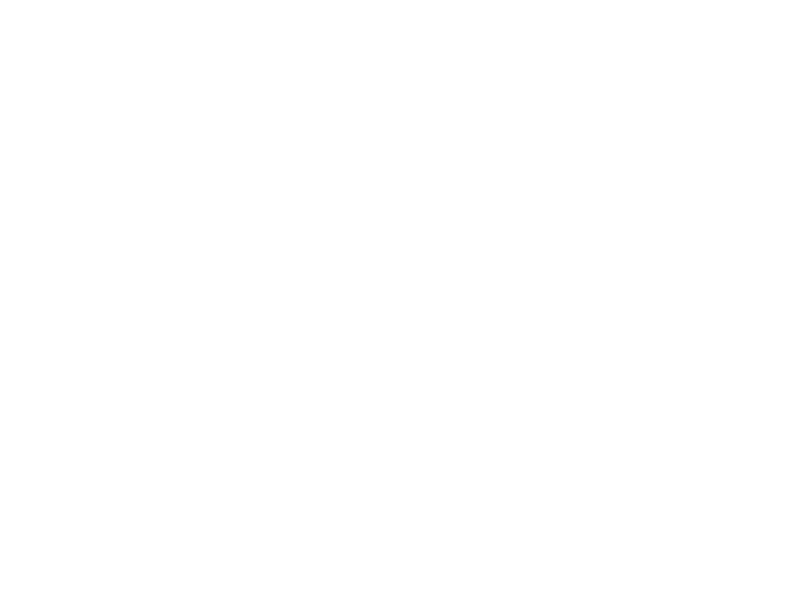
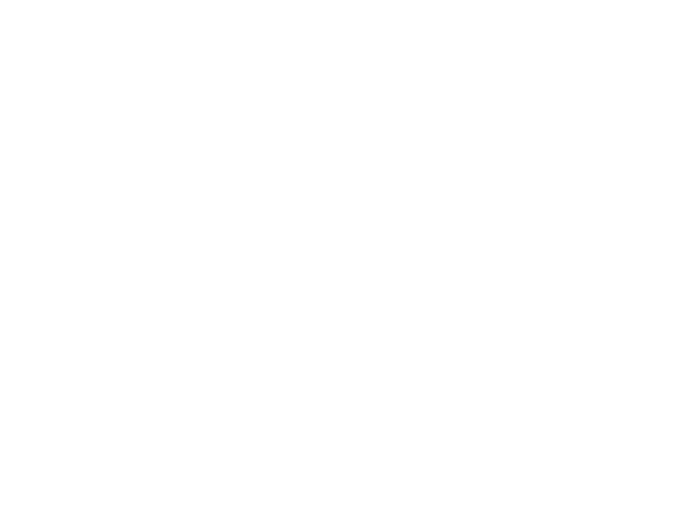
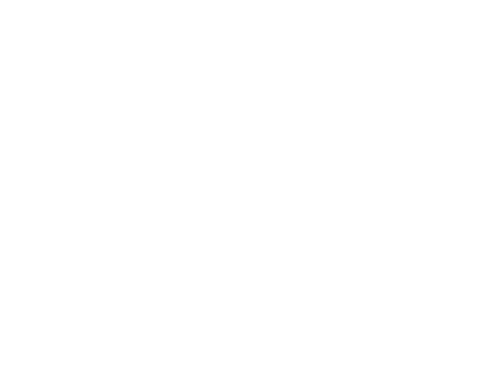

# Xiaohongshu User Feedback Analysis

## Project Overview

This project analyzes Xiaohongshu user reviews to identify user satisfaction, pain points, and product improvement opportunities.

The goal is to transform user feedback data into actionable product insights.

---

# Dataset

Dataset contains:

- 26 user reviews
- User ratings
- Review text
- Feedback categories
- Sentiment labels

---

# Analysis Process

## 1. User Satisfaction Analysis

Average Rating:

3.38 / 5

The result indicates moderate user satisfaction with opportunities for improvement.

---

## 2. Sentiment Analysis

User sentiment distribution:

- Positive: 50%
- Negative: 31%
- Neutral: 19%

Positive feedback mainly focuses on recommendation experience and content discovery.

Negative feedback mainly focuses on advertisement and search experience.

---

## 3. User Pain Point Analysis

Top discussed topics:

1. Recommendation
2. Search
3. Content Quality
4. Advertisement

---

# Product Insights

## Recommendation Optimization

### Problem

Some users experience repeated or less relevant recommendations.

### Solution

Improve recommendation diversity and personalization.

---

## Search Experience Improvement

### Problem

Users have difficulty discovering relevant content.

### Solution

Optimize search ranking and improve content matching.

---

## Advertisement Experience

### Problem

Excessive advertisements affect browsing experience.

### Solution

Improve advertisement frequency control.

---

# Visualization

## Rating Distribution

## Sentiment Distribution

## Feedback Categories

---

# Tools

Python  
Pandas  
Matplotlib  
Jupyter Notebook
